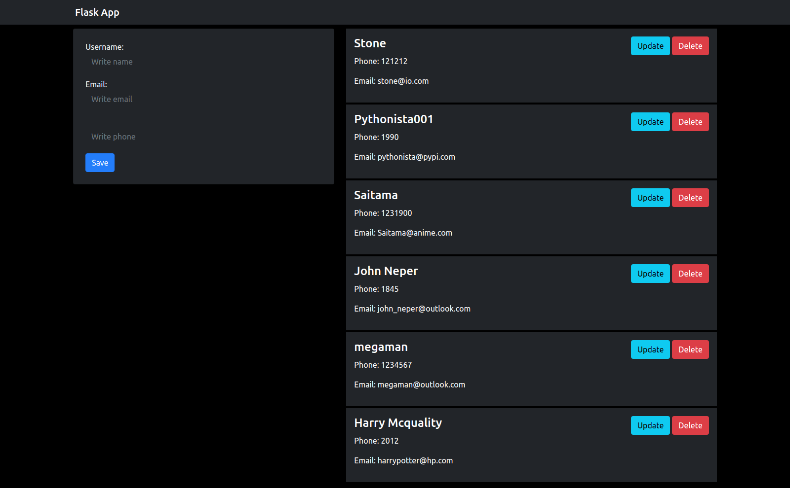

# Flask CRUD

This is a simple CRUD using flask and MySQL with SQLAlchemy.


## Manual Installation

### Requirements
* Python3
* MySQL

Check requirements.txt to watch all the dependencies

```
MYSQL_USER=
MYSQL_PASSWORD=
MYSQL_DATABASE=
MYSQL_HOST=
MYSQL_PORT=
```

```
git clone https://github.com/ArobyR/flask_crud
cd flask-sqlalchemy-crud
pip install -r requirements.txt
python index.py
```
## Screenshot :camera:

